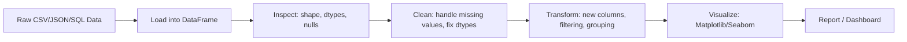
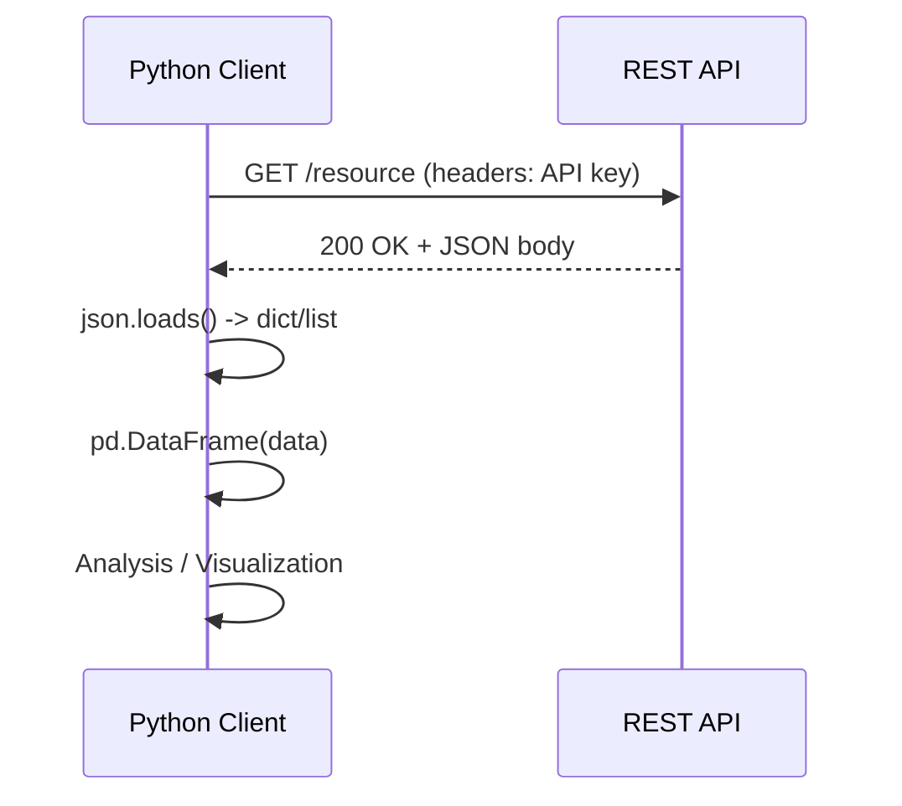
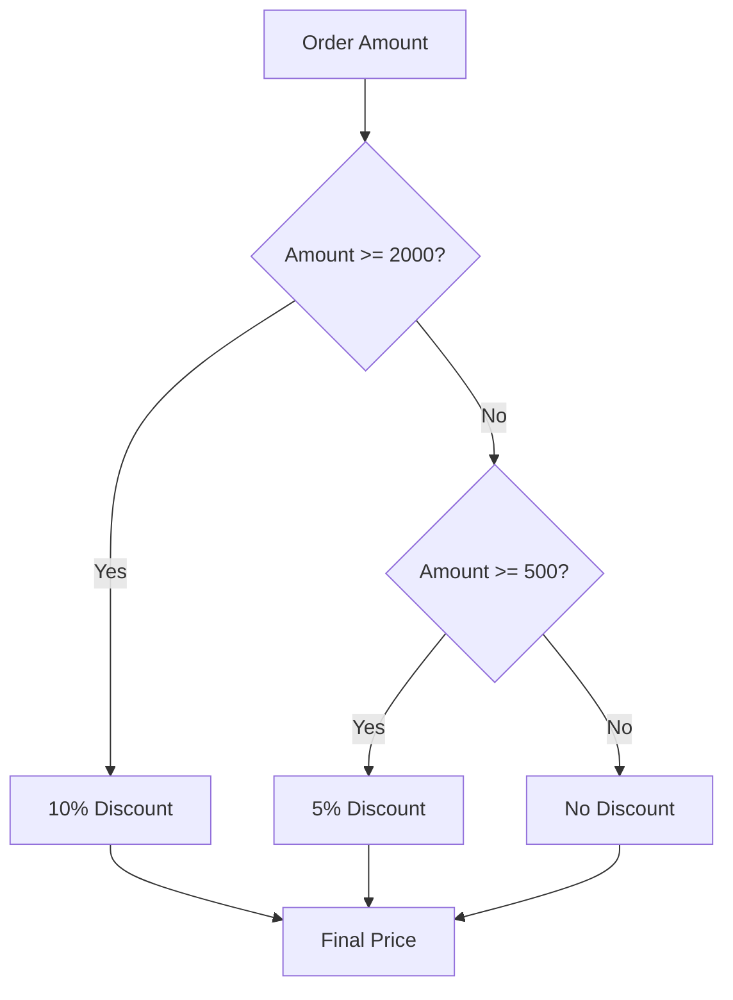
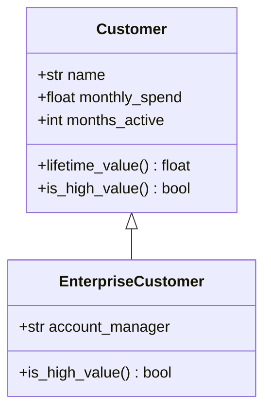
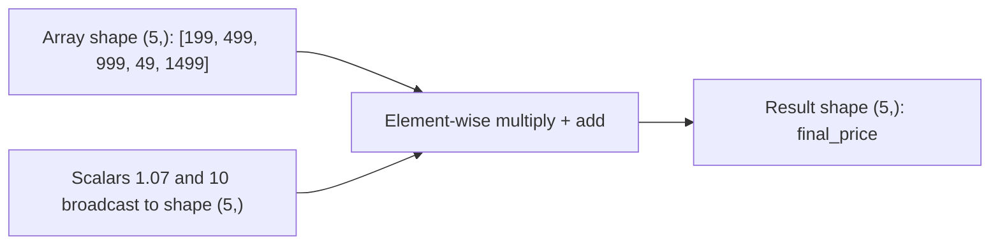
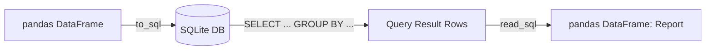

# Week 1 Diagrams: Python for Data Science & AI

## 1. Data Analysis Pipeline (Pandas)

## 2. API -> JSON -> DataFrame Flow

## 3. Control Flow: Discount Tier Logic

## 4. Class Hierarchy Example (OOP)

## 5. NumPy Broadcasting

## 6. SQL Query Execution Flow

