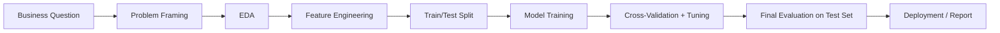
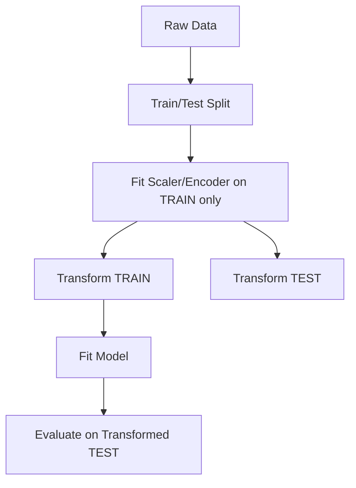
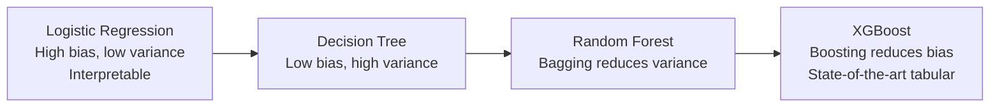
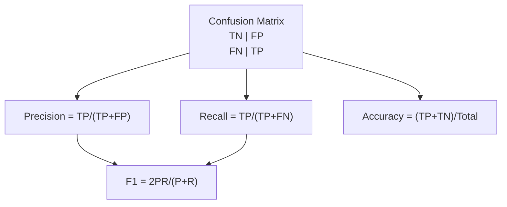
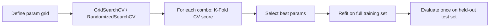

# Week 2 Diagrams: Machine Learning Basics & ML Workflow

## 1. ML Workflow Overview



## 2. Leakage-Free Preprocessing



## 3. Bias-Variance / Model Family Spectrum



## 4. Confusion Matrix & Metrics



## 5. K-Fold Cross-Validation

```mermaid
flowchart TD
    D[Training Data] --> S1[Fold 1: Test | Train Train Train Train]
    D --> S2[Fold 2: Train Test Train Train Train]
    D --> S3[Fold 3: Train Train Test Train Train]
    D --> S4[Fold 4: Train Train Train Test Train]
    D --> S5[Fold 5: Train Train Train Train Test]
    S1 --> AVG[Average +/- Std across 5 scores]
    S2 --> AVG
    S3 --> AVG
    S4 --> AVG
    S5 --> AVG
```

## 6. Hyperparameter Tuning Flow


