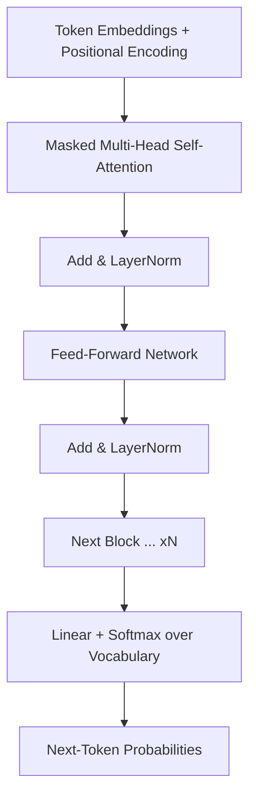
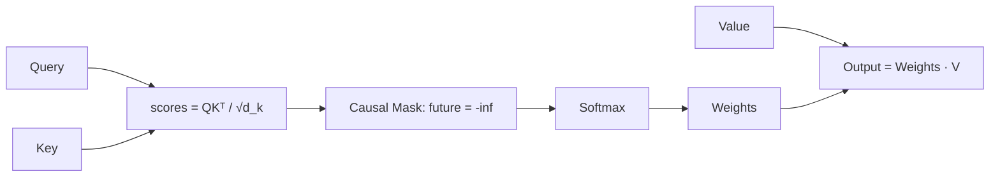
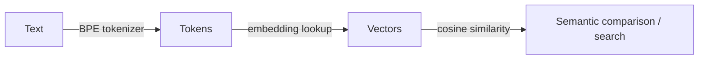
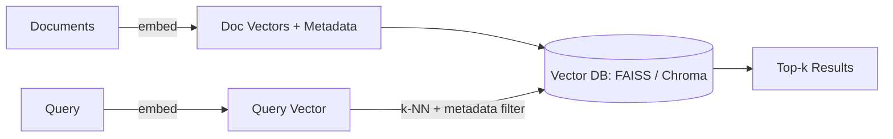
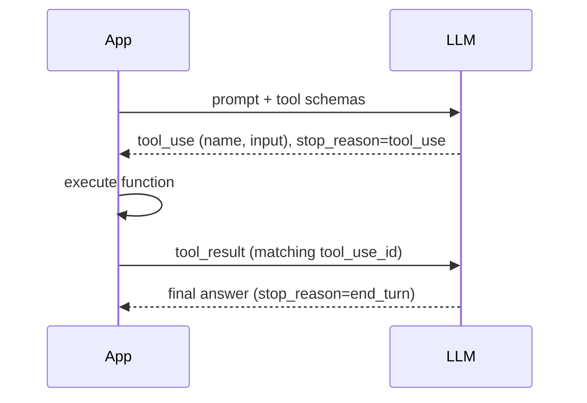
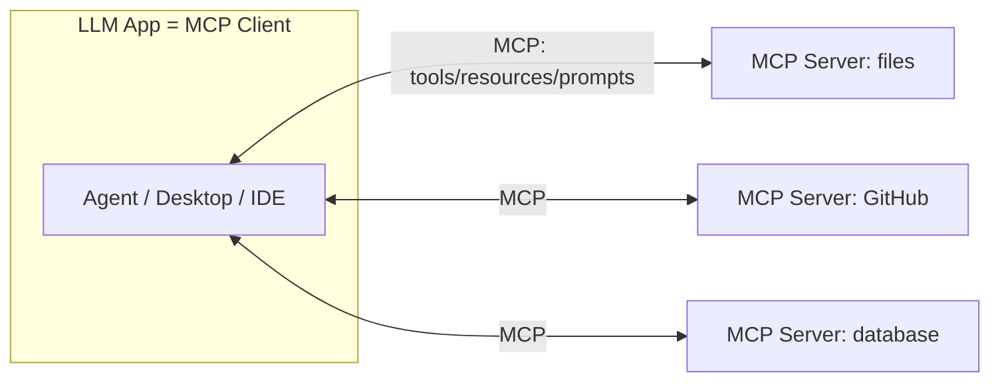
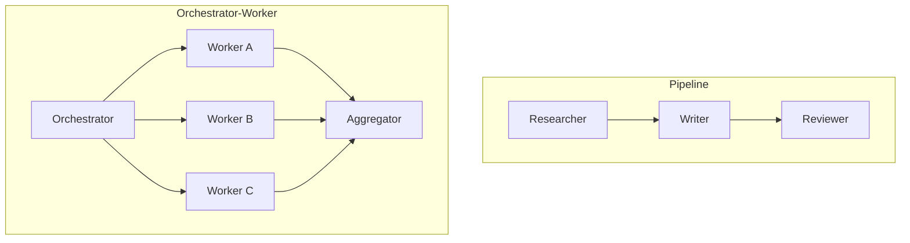

# Week 3 Diagrams: GenAI Foundations & LLM Working Procedure

## 1. Transformer Block (Decoder-Only)

## 2. Scaled Dot-Product Attention

## 3. Text → Tokens → Embeddings

## 4. RAG-Style Vector Search Pipeline

## 5. Tool / Function Calling Loop

## 6. MCP Architecture

## 7. Multi-Agent Patterns

