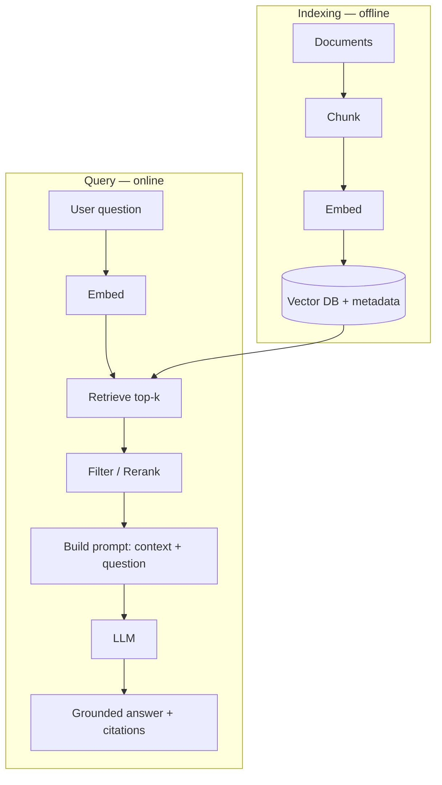
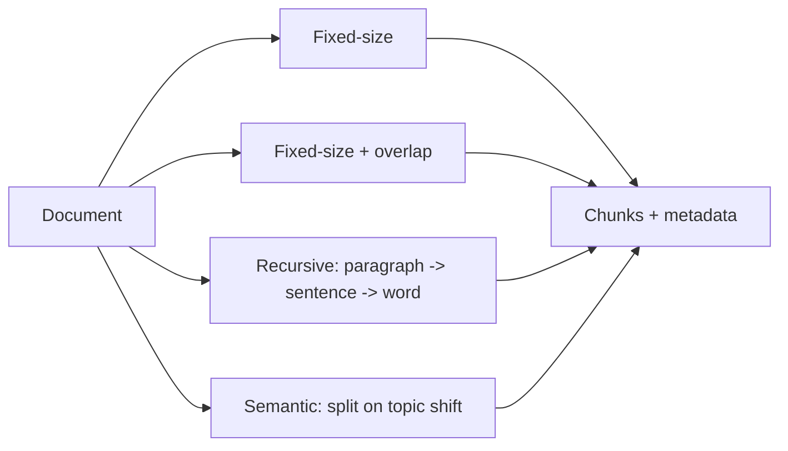
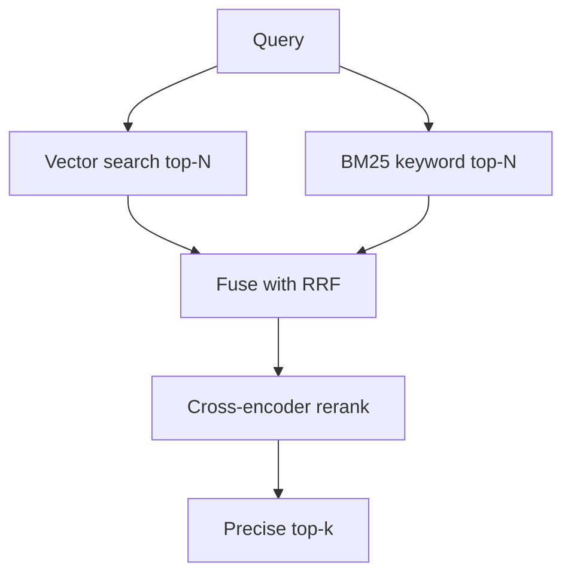
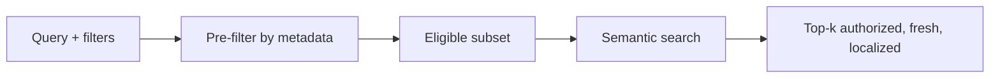
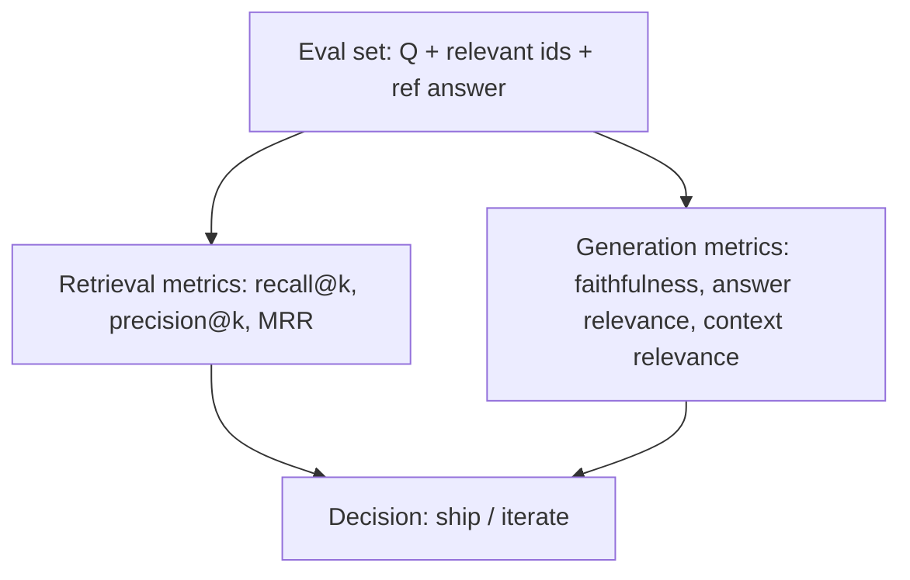
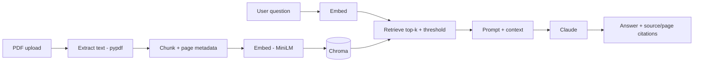

# Week 4 Diagrams: RAG — Retrieval Augmented Generation

## 1. Full RAG Pipeline

## 2. Chunking Strategies

## 3. Hybrid Search + Reranking

## 4. Metadata Filtering (pre-filter)

## 5. RAG Evaluation

## 6. PDF Chatbot Architecture

