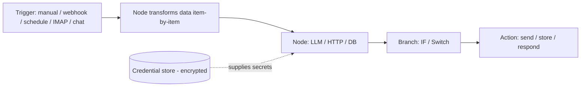
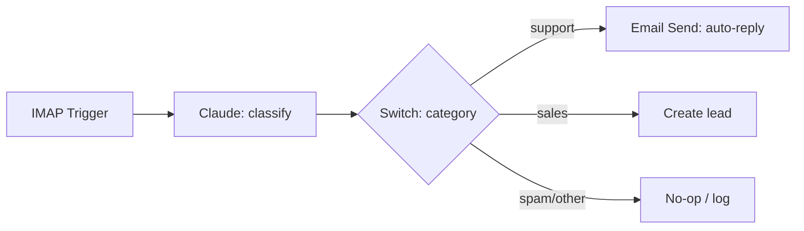
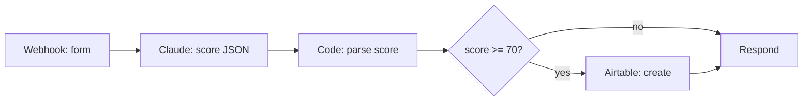
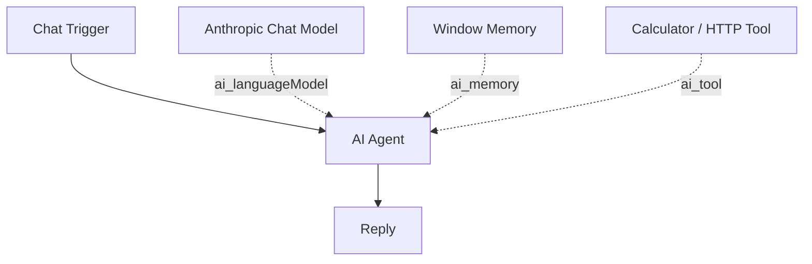
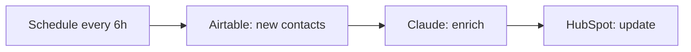
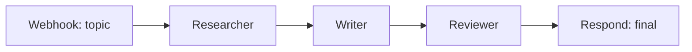

# Week 5 Diagrams: AI Automation with n8n

## 1. n8n Mental Model

## 2. Email Automation

## 3. Lead Qualification

## 4. AI Agent (tools + memory)

## 5. CRM Automation (scheduled)

## 6. Multi-Agent Content Pipeline

