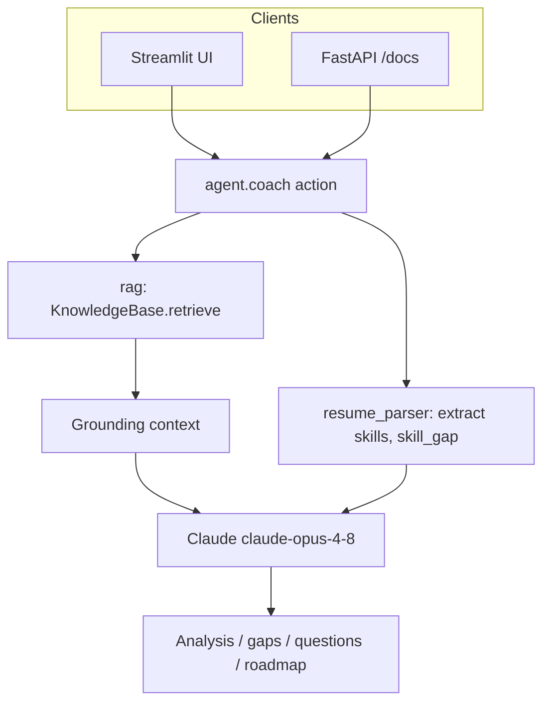
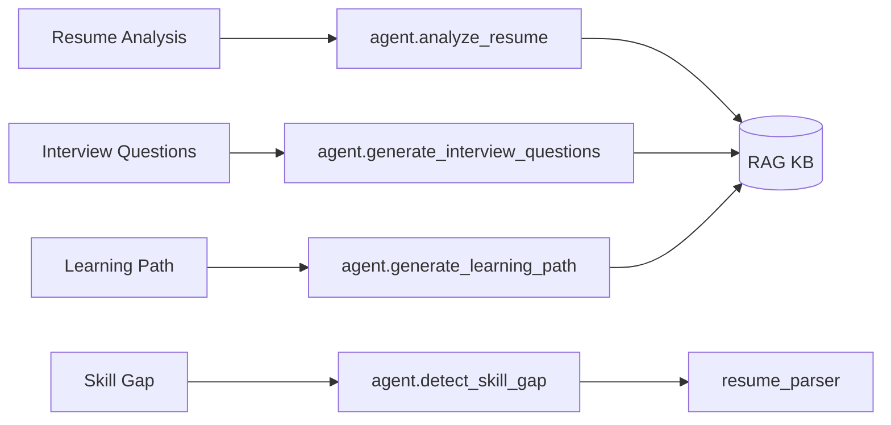
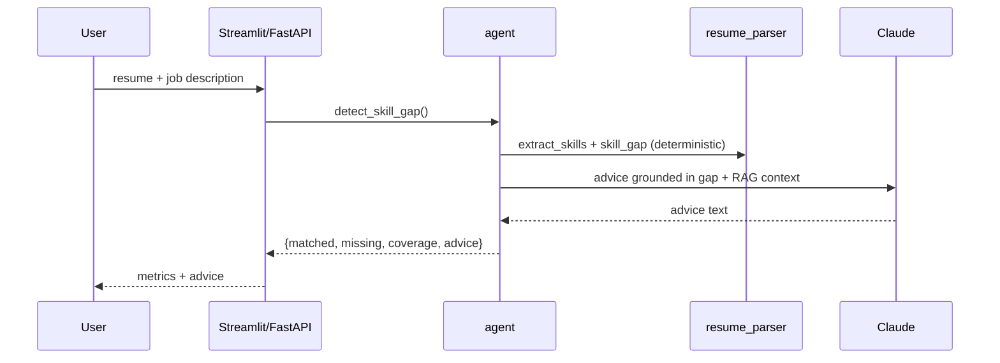
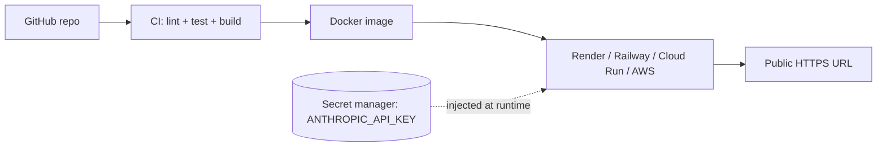
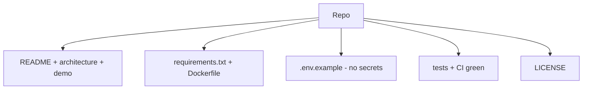

# Week 6 Diagrams: AI Career Coach (Capstone)

## 1. Application Architecture

## 2. Feature → Module Map

## 3. Request Flow (Skill Gap example)

## 4. Deployment Topology

## 5. GitHub Packaging

